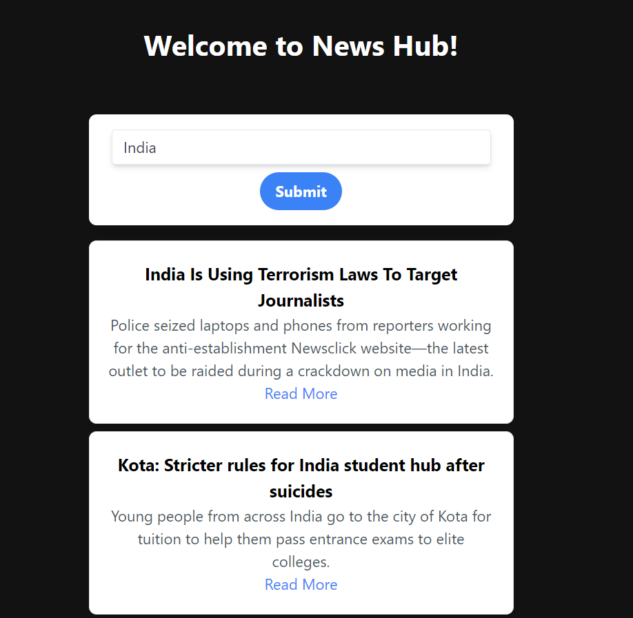

# NewsHub

Your Central Hub for Real-time News Updates. 
Fun project to explore more about angular & implementing API endpoints.

## Project Overview

NewsHub is a dynamic and intuitive web application that serves as your central hub for the latest and most relevant news from around the world. With a clean and user-friendly interface, NewsHub offers a seamless news browsing experience, allowing you to stay informed and connected with the ever-evolving world of news.

### Built With

- Angular 12
- HTML5 and CSS3
- Tailwind CSS

### Features
- Personalized News Feed
- Real-time Updates
- Comprehensive Coverage
- Search and Explore
- User Interaction
- Aesthetic Design

### API Used
[News API](https://newsapi.org)
